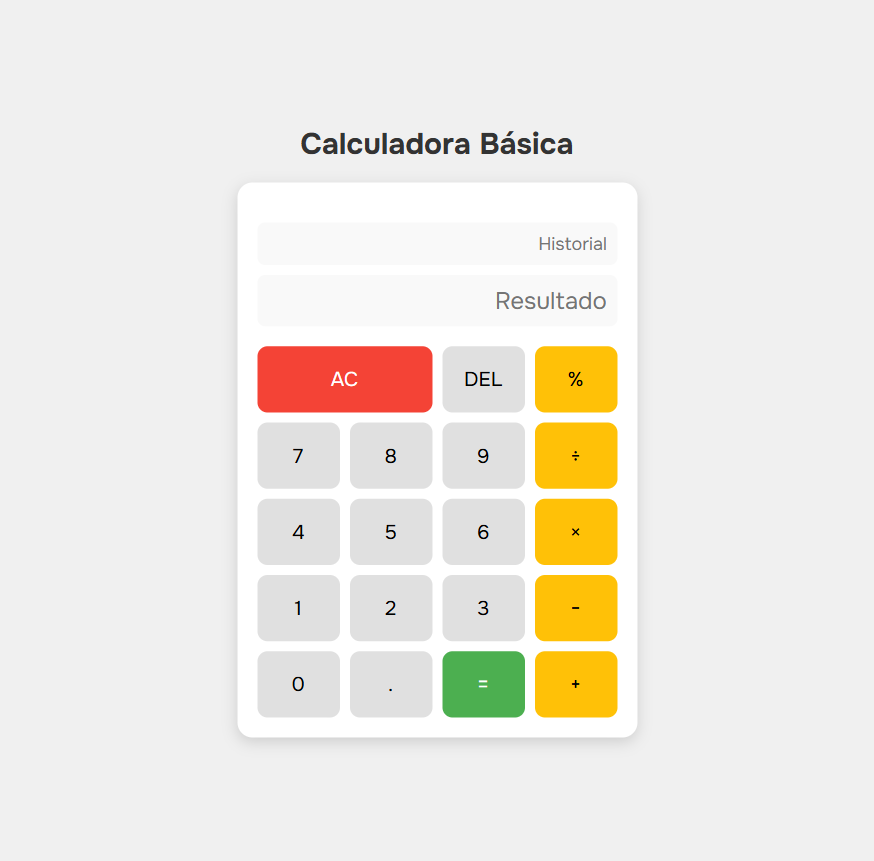

# 🧮 Calculadora Básica

Una calculadora básica interactiva desarrollada con HTML, CSS y JavaScript vanilla. Este es el **Proyecto #3** de mi serie de proyectos de desarrollo web.

## 📋 Descripción

Calculadora funcional que permite realizar operaciones matemáticas básicas con una interfaz limpia y moderna. Incluye soporte para teclado físico, historial de operaciones y manejo inteligente de errores.

## ✨ Características Implementadas

- **Operaciones básicas:** Suma (+), resta (−), multiplicación (×) y división (÷)
- **Operación de porcentaje:** Cálculo de porcentajes (%)
- **Decimales:** Soporte completo para números decimales
- **Historial:** Visualización de la operación anterior
- **Botón Clear inteligente:** Cambia entre AC (All Clear) y C (Clear)
- **Botón Delete:** Eliminación carácter por carácter
- **Soporte de teclado:** Control completo con teclado físico
- **Validación de entrada:** Prevención de operaciones inválidas
- **Manejo de errores:** Mensajes de error amigables
- **Interfaz responsiva:** Diseño adaptado para diferentes dispositivos
- **Efectos visuales:** Transiciones suaves y hover effects

## 🛠️ Tecnologías Utilizadas

- **HTML5:** Estructura semántica moderna con:
  - Formularios accesibles
  - Meta tags optimizados
  - Estructura grid para botones
- **CSS3:** Estilos avanzados con:
  - CSS Grid para layout de botones
  - Flexbox para contenedores
  - Transiciones y animaciones
  - Variables CSS implícitas
  - Box-shadow para profundidad
- **JavaScript ES6+:** Lógica avanzada con:
  - Event listeners para clicks y teclado
  - Manipulación del DOM
  - Manejo de errores con try-catch
  - Funciones puras y modulares
  - Validación de entrada
- **Google Fonts:** Tipografía Onest (100-900 weights)

## 🎨 Diseño y Estilo

### Paleta de Colores

```css
/* Tema limpio y profesional */
--bg-primary: #f0f0f0; /* Fondo de página */
--bg-calculator: #ffffff; /* Fondo de calculadora */
--bg-display: #f9f9f9; /* Fondo de pantalla */
--text-primary: #333; /* Texto principal */
--text-secondary: #666; /* Texto del historial */
--btn-default: #e0e0e0; /* Botones números */
--btn-operator: #ffc107; /* Botones operadores */
--btn-equal: #4caf50; /* Botón igual */
--btn-clear: #f44336; /* Botón limpiar */
```

### Efectos Especiales

- **Sombra elevada** en el contenedor principal
- **Transiciones suaves** en todos los botones (0.3s ease)
- **Efectos hover** con cambio de color
- **Grid layout responsivo** para botones
- **Bordes redondeados** modernos

## 📱 Diseño Responsivo

### Características

- **Ancho fijo optimizado:** 320px para máxima usabilidad
- **Grid de botones:** 4 columnas adaptables
- **Botón Clear extendido:** Ocupa 2 columnas para mayor accesibilidad
- **Centrado vertical y horizontal:** Perfecto en cualquier pantalla

## 📂 Estructura del Proyecto

```
03-calculadora-basica/
├── index.html              # Página principal
├── styles.css              # Estilos CSS
├── script.js               # Lógica JavaScript
├── screenshots/            # Capturas de pantalla
│   └── app-view.png        # Vista de la aplicación
└── README.md              # Documentación
```

## 🚀 Instalación y Uso

### Clonar el repositorio

```bash
git clone https://github.com/Zero-Fhx/03-calculadora-basica.git
cd 03-calculadora-basica
```

### Ejecutar el proyecto

1. **Método simple:** Abre `index.html` directamente en tu navegador
2. **Con Live Server (recomendado):**
   - Instala Live Server en VS Code
   - Click derecho en `index.html` → "Open with Live Server"
3. **Servidor local:**

   ```bash
   # Con Python 3
   python -m http.server 8000

   # Con Node.js (http-server)
   npx http-server
   ```

## ✅ Requisitos Cumplidos

Este proyecto incluye todas las características esenciales de una calculadora:

- [x] Operaciones básicas (+ − × ÷)
- [x] Teclado numérico funcional
- [x] Soporte para decimales
- [x] Diseño atractivo y responsivo
- [x] Manejo de errores
- [x] Funcionalidades adicionales (%, DEL, AC/C)
- [x] Soporte para teclado físico
- [x] Historial de operaciones

## 🌐 Demo en Vivo

🔗 **[Ver Demo](https://zero-fhx.github.io/03-calculadora-basica/)** (GitHub Pages)

## 📸 Captura de Pantalla



## 🔧 Características Técnicas Destacadas

### Manejo de Entrada de Teclado

```javascript
document.addEventListener("keydown", (e) => {
  if (
    [
      "Backspace",
      "Enter",
      "Escape",
      "c",
      "C",
      "+",
      "-",
      "*",
      "/",
      ".",
      "%",
    ].includes(e.key) ||
    !isNaN(e.key)
  ) {
    e.preventDefault();
  }
  handleKeyboardInput(e.key);
});
```

### Validación de Decimales

```javascript
function canAddDecimal() {
  const parts = currentOperation.split(/[\+\-\*\/%]/);
  const lastPart = parts[parts.length - 1];
  return !lastPart.includes(".");
}
```

### Botón Clear Inteligente

```javascript
function updateButtonC() {
  if (currentOperation === "") {
    clearButton.textContent = "AC";
  } else {
    clearButton.textContent = "C";
  }
}
```

### Manejo de Errores

```javascript
function buttonEquals() {
  try {
    if (lastChar() === ".") {
      currentOperation = currentOperation.slice(0, -1);
    } else if (isOperator(lastChar())) {
      addZeroToLastPart();
    }
    result = eval(currentOperation);
    updateHistory();
    currentOperation = result.toString();
    updateResult();
  } catch (error) {
    alert("Error en la operación: " + error.message);
    currentOperation = "Syntax Error";
    result = "";
    clearNextInput = true;
    updateResult();
  }
}
```

### Grid Layout CSS

```css
.buttons {
  display: grid;
  grid-template-columns: repeat(4, 1fr);
  gap: 0.5rem;
}

#clear {
  grid-column: span 2;
}
```

## ⌨️ Atajos de Teclado

| Tecla              | Función        |
| ------------------ | -------------- |
| `0-9`              | Números        |
| `+`                | Suma           |
| `-`                | Resta          |
| `*`                | Multiplicación |
| `/`                | División       |
| `%`                | Porcentaje     |
| `.`                | Decimal        |
| `Enter` o `=`      | Igual          |
| `Backspace`        | Eliminar       |
| `Escape`, `c`, `C` | Limpiar        |

## 🔮 Futuras Mejoras

- [ ] **Operaciones avanzadas** (√, x², sin, cos, tan)
- [ ] **Historial completo** con lista de operaciones anteriores
- [ ] **Modo científico** expandible
- [ ] **Temas personalizables** (claro/oscuro)
- [ ] **Memoria** (MC, MR, M+, M-)
- [ ] **Conversión de unidades** integrada
- [ ] **Animaciones de botones** más avanzadas
- [ ] **Sonidos de retroalimentación** opcionales
- [ ] **Exportar resultados** a portapapeles
- [ ] **Redimensionamiento** dinámico

## 📝 Lecciones Aprendidas

### JavaScript Avanzado

- **Event handling** para múltiples tipos de entrada
- **Manejo de errores** con try-catch
- **Validación de datos** en tiempo real
- **State management** con variables globales
- **String manipulation** para operaciones matemáticas

### Patrones de Desarrollo

- **Separación de responsabilidades** por función
- **Funciones puras** para validación
- **Event delegation** eficiente
- **Prevención de errores** proactiva

### CSS y UX Design

- **CSS Grid** para layouts complejos
- **Transiciones CSS** para feedback visual
- **Tipografía responsive**
- **Paleta de colores** intuitiva para diferentes tipos de botones
- **Accesibilidad** con contraste adecuado

### Usabilidad

- **Soporte dual** mouse y teclado
- **Feedback inmediato** en todas las acciones
- **Prevención de errores** de usuario
- **Claridad visual** en el diseño de interfaz

## 🤝 Contribuciones

Este es un proyecto personal de aprendizaje, pero si encuentras mejoras o tienes sugerencias:

1. Fork el repositorio
2. Crea una rama para tu feature (`git checkout -b feature/mejora`)
3. Commit tus cambios (`git commit -m 'Añadir mejora'`)
4. Push a la rama (`git push origin feature/mejora`)
5. Abre un Pull Request

## 👨‍💻 Autor

**Erick Obed Flores Ricra**

- 🐙 GitHub: [@Zero-Fhx](https://github.com/Zero-Fhx)
- 💼 LinkedIn: [Erick Obed Flores Ricra](https://www.linkedin.com/in/erick-obed-flores-ricra-14a121280)
- 📧 Email: erickflores170404@gmail.com

---

**🤖 Desarrollo Asistido por IA:** Este proyecto fue desarrollado con la asistencia de inteligencia artificial para la búsqueda de información, resolución de problemas técnicos, optimización de código, consulta de conceptos desconocidos y creación de esta documentación.
